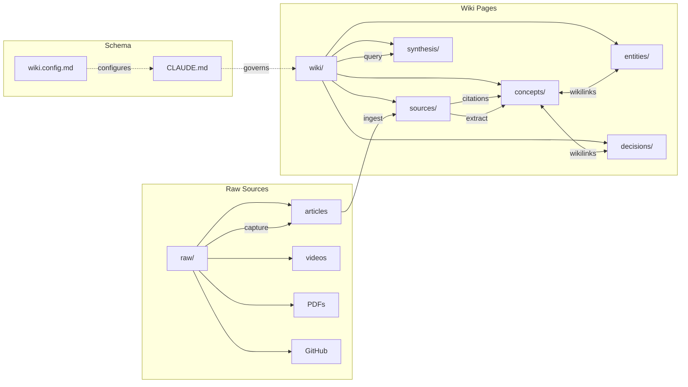

<div align="center">

# llm-obsidian-wiki

### LLMs forget everything between sessions. This plugin gives them a memory that compounds.


[The Problem](#the-problem) | [Install](#install) | [See It Work](#see-it-work) | [Quick Start](#quick-start) | [Architecture](#architecture) | [Skills](#skills-reference) | [Agents](#agents-reference)

</div>

---

## The Problem

LLMs lose all context between sessions. RAG systems re-derive knowledge from raw documents on every query, spending tokens to rediscover what was already known. In 2025, [Andrej Karpathy proposed](https://gist.github.com/karpathy/442a6bf555914893e9891c11519de94f) a different approach: have the LLM incrementally build and maintain a persistent wiki -- structured, interlinked markdown that compounds over time. The idea sparked a [400+ comment discussion](https://gist.github.com/karpathy/442a6bf555914893e9891c11519de94f) drawing on the Zettelkasten tradition and digital garden movement.

This plugin turns that idea into a working system. It is a Claude Code plugin with **4 task-oriented agents**, 7 internal workflow skills, 2 slash commands, and ~25 utility scripts that automate the full capture / research / answer / audit / maintain loop inside an Obsidian vault. Knowledge is compiled once and kept current -- not re-derived on every query.

## What's new in v0.4.0

- **Agent-first UX** — talk to the system in natural language; Claude triggers the right agent
- **Extended personas** with voice / vocabulary / anti-patterns / litmus tests
- **Sonnet-only** for token economy
- **defuddle → trafilatura → r.jina.ai** privacy-first web→md stack (cloud opt-in)
- **hot.md** rolling 500-word session cache
- **Tree topology lints** — index ≤100 links, hubs ≤15 members
- **Confidence + supersession** in frontmatter
- **Claim-level citations** with raw quotes and anchors
- **Forgetting curve** for stale-page detection

> [!IMPORTANT]
> **Trust and transparency**
>
> - **Local-only**: All data stays in your Obsidian vault on your machine. No cloud sync, no external storage.
> - **No telemetry**: No analytics, no usage tracking, no phone-home behavior of any kind.
> - **Network access**: Only capture scripts (`capture-url.sh`, `capture-youtube.sh`, `capture-github.sh`) make network requests, and only to URLs you explicitly provide.
> - **What it creates**: Files in `raw/`, `wiki/`, `index.md`, `log.md`, `wiki.config.md`, and `.obsidian/` config -- all inside your vault.
> - **Uninstall**: `/plugin remove llm-obsidian-wiki@ignromanov` -- your vault data remains untouched.

## Install

**Prerequisites**: [Claude Code](https://docs.anthropic.com/en/docs/claude-code), [Obsidian](https://obsidian.md/), [Obsidian CLI](https://help.obsidian.md/cli)

From the Claude Code plugin marketplace:

```bash
# Add the marketplace source
/plugin marketplace add ignromanov/llm-obsidian-wiki

# Install the plugin
/plugin install llm-obsidian-wiki@ignromanov
```

Or load directly from a local clone:

```bash
git clone https://github.com/ignromanov/llm-obsidian-wiki.git
claude --plugin-dir /path/to/llm-obsidian-wiki
```

## See It Work

```
$ claude

> /wiki:init

  What is the project/wiki name? ml-research
  Which page types? (all 10 selected)
  Which raw source directories? (defaults: knowledge, specs, meetings, docs, external, inbox)
  Which capture tools are installed? defuddle, trafilatura

  Wiki vault "ml-research" created successfully.
  Files: CLAUDE.md, wiki.config.md, index.md, hot.md, log.md
  Next: open the vault in Obsidian, add your first source.

> "исследуй karpathy llm wiki pattern"

  [wiki-researcher]
  Capturing: https://gist.github.com/karpathy/442a6bf555914893e9891c11519de94f
  Saved: raw/external/2026-04-11-karpathy-llm-wiki-pattern.md

  Compiling wiki pages...
  Created: wiki/sources/src-karpathy-llm-wiki-pattern.md
  Created: wiki/concepts/llm-wiki-pattern.md  (confidence: high, 3 sources)
  Created: wiki/concepts/compounding-knowledge.md
  Updated: index.md, hot.md, log.md

> "как compounding knowledge отличается от RAG?"

  [wiki-advisor]
  Searching wiki... 3 pages found, reading 2...

  RAG re-derives answers from raw documents on each query, paying full token
  cost every time. The LLM Wiki pattern ([[llm-wiki-pattern]]) compiles
  knowledge once into structured [[compounding-knowledge]] pages maintained
  incrementally. Subsequent queries read the compiled wiki instead of
  re-processing raw sources.

  Sources: [[src-karpathy-llm-wiki-pattern]], [[compounding-knowledge]]

> "наведи порядок"

  [wiki-curator]
  Running health checks...
  ✓ No orphaned pages
  ✓ No broken wikilinks
  ⚠ 1 stale page detected: wiki/concepts/compounding-knowledge.md (90 days)
  Auto-fixed: index drift resolved
  Report saved: log.md
```

## Quick Start

1. **Install** the plugin (see [Install](#install))
2. **`/wiki:init`** -- interactive wizard scaffolds the vault structure, CLAUDE.md schema, and config
3. **`"исследуй <topic>"`** -- wiki-researcher captures sources and compiles wiki pages
4. **`"что мы решили про <topic>?"`** -- wiki-advisor answers with `[[wikilink]]` citations
5. **`"наведи порядок"`** -- wiki-curator audits health and fixes issues
6. **`"save this URL: <url>"`** -- wiki-scribe captures verbatim, no interpretation

## Architecture

Three layers with strict data flow:



| Layer | Path | Mutability | Owner |
|-------|------|------------|-------|
| **Raw Sources** | `raw/` | Immutable after capture | Human + capture tools |
| **Wiki Pages** | `wiki/` | LLM-maintained | LLM agents |
| **Schema** | `CLAUDE.md` | Human-approved edits only | Human + LLM co-evolve |

<details>
<summary>Architecture deep-dive</summary>

### Data flow in detail

**Capture** collects external content (articles, YouTube transcripts, PDFs, GitHub issues, tweets, git logs) into `raw/` as immutable markdown files with structured YAML frontmatter. Each file records its `source_type`, `source_url`, `captured` date, and `author`.

**Ingest** reads a raw source and produces two things: a `source-summary` page in `wiki/sources/` (the TLDR and key points), and one or more concept/entity/decision pages in the appropriate `wiki/` subdirectory. Every page links back to its raw source via `sources:` frontmatter, creating a verifiable provenance chain. When a new source contradicts an existing page, the ingest process creates a decision record documenting the conflict and resolution.

**Query** searches the wiki using progressive disclosure -- L0 (title + TLDR from search results) for triage, then L2 (full page read) only for relevant hits. Answers cite wiki pages via `[[wikilinks]]`. Results can be filed back as `synthesis` pages, growing the wiki.

**Lint** runs health checks: orphaned pages, broken wikilinks, stale content, shallow pages, missing TLDRs, source hash drift, and index drift. Fix mode auto-resolves safe issues; deep mode re-reads raw sources to detect content drift.

### Provenance tracking

Every wiki page carries `source_hashes:` in frontmatter -- SHA-256 hashes of the raw files it was built from. When lint runs, it recomputes hashes and flags any mismatch as "source drift," meaning the raw file changed after the wiki page was created.

### Epistemic scoring

Pages carry a `confidence:` field (low/medium/high) based on source corroboration:
- **low** -- single source, no independent verification
- **medium** -- 2+ sources that independently corroborate claims
- **high** -- 3+ independent sources in agreement

Concept pages include a `## Counter-Arguments & Gaps` section to explicitly flag the strongest objections and what the source leaves unaddressed.

### Relations graph

The `relations:` frontmatter field tracks typed links between pages: `contradicts`, `supports`, `is-a`, `part-of`, `evolved_into`, `depends_on`. These supplement wikilinks with semantic meaning, enabling richer graph queries.

### Session continuity

Every log entry includes `Deferred:` (unresolved issues) and `Next:` (suggested follow-up actions). The next agent session can read `log.md` to pick up where the previous session left off.

</details>

## Slash Commands

In v0.4.0, most functions are triggered by natural language — talk to Claude and the right agent activates automatically. Only two explicit slash commands remain:

| Command | Purpose |
|---------|---------|
| `/wiki:init` | Interactive wizard — scaffolds vault structure, schema, config |
| `/wiki:status` | Wiki metrics — page counts, health summary, unprocessed sources |

Everything else (capture, research, answer, audit, maintain, migrate) is handled by the four agents via natural language invocation.

## Agents Reference

| Agent | Persona | When to invoke |
|---|---|---|
| **wiki-researcher** | Полевой исследователь-архивист. Karpathy-style: compile knowledge once with provenance | "исследуй X", "investigate Y", "build write-up about Z" |
| **wiki-advisor** | Senior consultant. Reads only `wiki/`, always cites with `[[wikilinks]]` | "что мы решили про X", "answer from wiki", "what does the wiki say" |
| **wiki-curator** | Librarian-archaeologist. Lint, drift detection, supersession, hub split, schema migration | "наведи порядок", "audit health", "fix issues", "migrate schema" |
| **wiki-scribe** | Court-reporter. Passive intake — preserves verbatim, no interpretation | "save this URL/PDF/clipboard", "запиши это" |

All agents on `model: sonnet`. Sequential / flag-and-continue communication. Most agent functions are triggered by natural language — no slash command needed.

<details>
<summary>Scripts reference</summary>

17 utility scripts in `scripts/` (plus 4 shared helpers in `scripts/lib/`):

| Script | Purpose |
|--------|---------|
| `init-vault.sh` | Create vault directory structure from config |
| `capture-url.sh` | Capture web article via defuddle |
| `capture-youtube.sh` | Capture YouTube transcript via yt-dlp |
| `capture-github.sh` | Capture GitHub issue/PR/discussion/repo via gh |
| `capture-prs.sh` | Batch capture merged PRs since a date |
| `capture-git-log.sh` | Capture git commit history as markdown |
| `create-page.sh` | Create wiki page from template |
| `find-unprocessed.sh` | List raw files without source summaries |
| `page-context.sh` | Get page metadata, backlinks, and outgoing links |
| `regenerate.sh` | Regenerate index.md and _hub.md files |
| `section-browse.sh` | List pages in a wiki section with TLDRs |
| `update-hubs.sh` | Update per-directory _hub.md files |
| `update-index.sh` | Rebuild index.md from page TLDRs |
| `wiki-health.sh` | Quick health check (orphans, broken links, dead ends) |
| `wiki-search.sh` | Search with inline TLDRs and related tags |
| `wiki-stats.sh` | Vault totals, per-section counts, activity dates |

Plus `scripts/lib/` (4 shared helpers: `read-yaml-key.sh`, `portable-hash.sh`, `canonical-path.sh`, `check-deps.sh`), `scripts/templates/` (10 page templates, one per type), and `scripts/migrations/` (versioned migration scripts).

</details>

<details>
<summary>Schema reference</summary>

### Page types

| Type | Directory | Purpose |
|------|-----------|---------|
| `concept` | `wiki/concepts/` | Definitions, mechanisms, mental models |
| `entity` | `wiki/entities/` | External tools, technologies, protocols |
| `architecture` | `wiki/architecture/` | System designs, data flows, components |
| `decision` | `wiki/decisions/` | Problem, options, chosen path, rationale (ADRs) |
| `strategy` | `wiki/strategy/` | Plans, roadmaps, goals, metrics |
| `org` | `wiki/orgs/` | Organizations, contacts, relationship history |
| `comparison` | `wiki/comparisons/` | Structured X vs Y evaluations |
| `open-question` | `wiki/open-questions/` | Unknowns, hypotheses, research needed |
| `source-summary` | `wiki/sources/` | TLDR + key takeaways per raw source |
| `synthesis` | `wiki/synthesis/` | Cross-source analyses, filed-back query results |

### Frontmatter fields

```yaml
---
title: "Human-readable title"
type: concept              # required -- one of the 10 types above
created: 2026-04-11        # required -- ISO date
updated: 2026-04-11        # required -- ISO date, updated on every edit
status: draft              # required -- draft | active | stale | superseded
tldr: "One paragraph"      # required -- progressive disclosure summary
tags:                      # required -- lowercase, hyphenated
  - tag1
sources:                   # required -- wikilinks to raw/ files
  - "[[raw/external/2026-04-11-article.md|Article Title]]"
confidence: low            # v0.2.0 -- low | medium | high
relations:                 # v0.2.0 -- typed entity relations
  - type: supports         #   contradicts | supports | is-a | part-of | evolved_into | depends_on
    target: "[[page]]"
    note: "brief reason"
source_hashes:             # v0.2.0 -- provenance tracking
  - path: "raw/external/2026-04-11-article.md"
    sha256: "a1b2c3..."
aliases:                   # optional -- alternative names for the page
  - Alternative Title
---
```

### Schema versioning

The vault tracks its schema version in `wiki.config.md` via the `schema_version` field. When the plugin updates, the `wiki-migrate-agent` compares the vault's schema version against the plugin version and runs migration scripts in sequence (e.g., `v0.1.0-to-v0.2.0.sh`). Migrations are idempotent -- running them twice is safe.

Current migration path: `0.1.0` -> `0.2.0` (adds `confidence`, `relations`, `source_hashes` fields; adds counter-arguments sections to concept pages).

</details>

## Prerequisites

**Required:**

- [Claude Code](https://docs.anthropic.com/en/docs/claude-code) -- the plugin host
- [Obsidian](https://obsidian.md/) -- vault viewer and graph visualization
- [Obsidian CLI](https://help.obsidian.md/cli) -- search, backlinks, tags, property management

**Recommended** (extend capture capabilities):

| Tool | Install | Used for |
|------|---------|----------|
| [defuddle](https://github.com/kepano/defuddle) | `npm i -g defuddle-cli` | Web articles to clean markdown (primary extractor) |
| [trafilatura](https://trafilatura.readthedocs.io/) | `uv tool install trafilatura` | Web→markdown fallback extractor (privacy-first) |
| [yt-dlp](https://github.com/yt-dlp/yt-dlp) | `brew install yt-dlp` | YouTube transcript extraction |
| [pandoc](https://pandoc.org/) | `brew install pandoc` | PDF/HTML/DOCX to markdown conversion |
| [gh](https://cli.github.com/) | `brew install gh` | GitHub issues, PRs, discussions |
| [qmd](https://github.com/tobi/qmd) | See repo | Local hybrid BM25/vector search (useful at 100+ pages) |
| [Dataview](https://github.com/blacksmithgu/obsidian-dataview) | Obsidian plugin | Query frontmatter with SQL-like syntax |

## Configuration

All vault settings live in `wiki.config.md` at the vault root. This file is created by `/wiki:init` and read by every skill and agent on invocation.

Key fields in the YAML frontmatter:

| Field | Purpose |
|-------|---------|
| `project` | Vault/project name |
| `schema_version` | Current schema version (for migrations) |
| `page_types` | Enabled page types |
| `raw_dirs` | Raw source subdirectories |
| `capture_tools` | Installed capture tools |
| `plugin_root` | Path to the plugin directory |
| `vault_name` | Obsidian vault name (for CLI commands, e.g. `obsidian vault=<name>`) |
| `vault_path` | Absolute path to the vault root (for bash scripts) — **required in v0.3.0** |

Edit the YAML frontmatter values directly. Skills pick up changes on next invocation.

> [!IMPORTANT]
> **v0.3.0 breaking change:** `wiki.config.md` now requires BOTH `vault_name` AND `vault_path`. If you are upgrading from v0.2.0, add `vault_path: /absolute/path/to/your/vault` to your config file and run `/wiki:migrate`.

### Migration from v0.3.0

Run the migration script after upgrading to v0.4.0:

```bash
${CLAUDE_PLUGIN_ROOT}/scripts/migrations/v0.3.0-to-v0.4.0/migrate.sh --vault /path/to/vault
```

See `docs/migration-v0.3.0-to-v0.4.0.md` for a full list of changes (new agent definitions, hot.md session cache, updated frontmatter fields).

### Migration from v0.2.0

Run `/wiki:migrate` after upgrading. The migrate skill (backed by `wiki-migrate-agent`) detects your current schema version and applies any missing migration scripts automatically. It is idempotent -- safe to run multiple times.

### Security

`capture-url.sh` enforces HTTPS-only capture and rejects loopback addresses (`127.0.0.1`, `::1`), link-local ranges, and RFC1918 private IP ranges. Attempts to capture `file://`, `http://`, or cloud metadata endpoints (e.g. `169.254.169.254`) are blocked at the script level.

## Versioning

The plugin tracks schema versions to handle breaking changes gracefully:

1. `wiki.config.md` stores `schema_version` (the vault's current schema)
2. `plugin.json` stores `version` (the plugin's expected schema)
3. When they differ, the `wiki-migrate-agent` bridges the gap by running versioned migration scripts from `scripts/migrations/`

Migrations are sequential (`v0.1.0-to-v0.2.0`, then `v0.2.0-to-v0.3.0`) and idempotent. The bash script handles bulk deterministic changes; the agent handles intelligent adjustments that require reading page content.

Current migration path: `0.1.0` → `0.2.0` → `0.3.0`. The v0.2.0→v0.3.0 migration adds the `vault_path` field to `wiki.config.md`. Run `/wiki:migrate` to apply.

## Contributing

Contributions are welcome. The plugin is structured as:

```
llm-obsidian-wiki/
  .claude-plugin/plugin.json   # plugin metadata
  skills/                       # 8 skill definitions (SKILL.md + references)
  agents/                       # 5 agent definitions
  scripts/                      # 17 bash utility scripts + scripts/lib/ (4 shared helpers)
  scripts/templates/            # 10 page templates
  scripts/migrations/           # versioned migration scripts
  SKILL.md                      # marketplace overview
  CHANGELOG.md                  # version history
```

To test locally: `claude --plugin-dir /path/to/your/clone`

## Credits

- [Andrej Karpathy's LLM Wiki gist](https://gist.github.com/karpathy/442a6bf555914893e9891c11519de94f) -- the idea that started this, and the community discussion that shaped it
- [Obsidian](https://obsidian.md/) -- the vault platform, graph visualization, and CLI
- [Claude Code](https://docs.anthropic.com/en/docs/claude-code) -- the plugin runtime

## License

[MIT](LICENSE) -- Ignat Romanov, 2026
