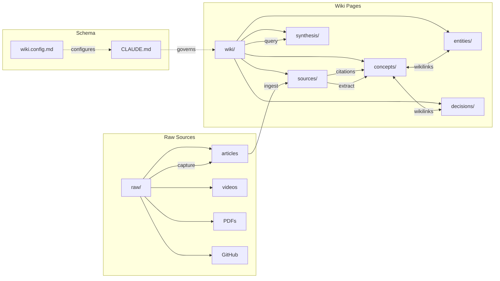

<div align="center">

# llm-obsidian-wiki

### LLMs forget everything between sessions. This plugin gives them a memory that compounds.


[The Problem](#the-problem) | [Install](#install) | [See It Work](#see-it-work) | [Quick Start](#quick-start) | [Architecture](#architecture) | [Skills](#skills-reference) | [Agents](#agents-reference)

</div>

---

## The Problem

LLMs lose all context between sessions. RAG systems re-derive knowledge from raw documents on every query, spending tokens to rediscover what was already known. In 2025, [Andrej Karpathy proposed](https://gist.github.com/karpathy/442a6bf555914893e9891c11519de94f) a different approach: have the LLM incrementally build and maintain a persistent wiki -- structured, interlinked markdown that compounds over time. The idea sparked a [400+ comment discussion](https://gist.github.com/karpathy/442a6bf555914893e9891c11519de94f) drawing on the Zettelkasten tradition and digital garden movement.

This plugin turns that idea into a working system. It is a Claude Code plugin with 7 skills, 5 agents, and 16 utility scripts that automates the full capture, ingest, query, and lint loop inside an Obsidian vault. Knowledge is compiled once and kept current -- not re-derived on every query.

> [!IMPORTANT]
> **Trust and transparency**
>
> - **Local-only**: All data stays in your Obsidian vault on your machine. No cloud sync, no external storage.
> - **No telemetry**: No analytics, no usage tracking, no phone-home behavior of any kind.
> - **Network access**: Only capture scripts (`capture-url.sh`, `capture-youtube.sh`, `capture-github.sh`) make network requests, and only to URLs you explicitly provide.
> - **What it creates**: Files in `raw/`, `wiki/`, `index.md`, `log.md`, `wiki.config.md`, and `.obsidian/` config -- all inside your vault.
> - **Uninstall**: `/plugin remove llm-obsidian-wiki@llm-obsidian-wiki` -- your vault data remains untouched.

## Install

**Prerequisites**: [Claude Code](https://docs.anthropic.com/en/docs/claude-code), [Obsidian](https://obsidian.md/), [Obsidian CLI](https://help.obsidian.md/cli)

From the Claude Code plugin marketplace:

```bash
# Add the marketplace source
/plugin marketplace add ignromanov/llm-obsidian-wiki

# Install the plugin
/plugin install llm-obsidian-wiki@llm-obsidian-wiki
```

Or load directly from a local clone:

```bash
git clone https://github.com/ignromanov/llm-obsidian-wiki.git
claude --plugin-dir /path/to/llm-obsidian-wiki
```

## See It Work

```
$ claude

> /wiki:init

  What is the project/wiki name? ml-research
  Which page types? (all 10 selected)
  Which raw source directories? (defaults: knowledge, specs, meetings, docs, external, inbox)
  Which capture tools are installed? defuddle, yt-dlp

  Wiki vault "ml-research" created successfully.
  Files: CLAUDE.md, wiki.config.md, index.md, log.md
  Next: open the vault in Obsidian, add your first source.

> /wiki:capture https://gist.github.com/karpathy/442a6bf555914893e9891c11519de94f

  Detected: article (URL)
  Running: capture-url.sh
  Saved: raw/external/2026-04-11-karpathy-llm-wiki-pattern.md
  Frontmatter: title="LLM Wiki", source_type=article, captured=2026-04-11

> /wiki:ingest raw/external/2026-04-11-karpathy-llm-wiki-pattern.md

  Reading source... extracting key concepts...

  Key takeaways:
    1. LLM as wiki maintainer, not just query engine
    2. Three-layer architecture: raw -> wiki -> schema
    3. Knowledge compounds across sessions
    4. Wikilinks create a navigable graph

  Which are most important? (all)

  Created: wiki/sources/src-karpathy-llm-wiki-pattern.md
  Created: wiki/concepts/llm-wiki-pattern.md
  Created: wiki/concepts/compounding-knowledge.md
  Updated: index.md, log.md

> /wiki:query "How does compounding knowledge differ from RAG?"

  Searching wiki... 3 pages found, reading 2...

  Answer: RAG re-derives answers from raw documents on each query,
  paying full token cost every time. The LLM Wiki pattern ([[llm-wiki-pattern]])
  compiles knowledge once into structured [[compounding-knowledge]] pages that
  are maintained incrementally. Subsequent queries read the compiled wiki
  instead of re-processing raw sources.

  Sources: [[src-karpathy-llm-wiki-pattern]], [[compounding-knowledge]]

  File back as wiki page? yes
  Created: wiki/synthesis/rag-vs-compounding-knowledge.md
```

## Quick Start

1. **Install** the plugin (see [Install](#install))
2. **`/wiki:init`** -- interactive wizard scaffolds the vault structure, CLAUDE.md schema, and config
3. **`/wiki:capture <url>`** -- collect your first source into `raw/`
4. **`/wiki:ingest`** -- process the raw source into structured wiki pages
5. **`/wiki:query "your question"`** -- ask the wiki something and get cited answers

## Architecture

Three layers with strict data flow:



| Layer | Path | Mutability | Owner |
|-------|------|------------|-------|
| **Raw Sources** | `raw/` | Immutable after capture | Human + capture tools |
| **Wiki Pages** | `wiki/` | LLM-maintained | LLM agents |
| **Schema** | `CLAUDE.md` | Human-approved edits only | Human + LLM co-evolve |

<details>
<summary>Architecture deep-dive</summary>

### Data flow in detail

**Capture** collects external content (articles, YouTube transcripts, PDFs, GitHub issues, tweets, git logs) into `raw/` as immutable markdown files with structured YAML frontmatter. Each file records its `source_type`, `source_url`, `captured` date, and `author`.

**Ingest** reads a raw source and produces two things: a `source-summary` page in `wiki/sources/` (the TLDR and key points), and one or more concept/entity/decision pages in the appropriate `wiki/` subdirectory. Every page links back to its raw source via `sources:` frontmatter, creating a verifiable provenance chain. When a new source contradicts an existing page, the ingest process creates a decision record documenting the conflict and resolution.

**Query** searches the wiki using progressive disclosure -- L0 (title + TLDR from search results) for triage, then L2 (full page read) only for relevant hits. Answers cite wiki pages via `[[wikilinks]]`. Results can be filed back as `synthesis` pages, growing the wiki.

**Lint** runs health checks: orphaned pages, broken wikilinks, stale content, shallow pages, missing TLDRs, source hash drift, and index drift. Fix mode auto-resolves safe issues; deep mode re-reads raw sources to detect content drift.

### Provenance tracking

Every wiki page carries `source_hashes:` in frontmatter -- SHA-256 hashes of the raw files it was built from. When lint runs, it recomputes hashes and flags any mismatch as "source drift," meaning the raw file changed after the wiki page was created.

### Epistemic scoring

Pages carry a `confidence:` field (low/medium/high) based on source corroboration:
- **low** -- single source, no independent verification
- **medium** -- 2+ sources that independently corroborate claims
- **high** -- 3+ independent sources in agreement

Concept pages include a `## Counter-Arguments & Gaps` section to explicitly flag the strongest objections and what the source leaves unaddressed.

### Relations graph

The `relations:` frontmatter field tracks typed links between pages: `contradicts`, `supports`, `is-a`, `part-of`, `evolved_into`, `depends_on`. These supplement wikilinks with semantic meaning, enabling richer graph queries.

### Session continuity

Every log entry includes `Deferred:` (unresolved issues) and `Next:` (suggested follow-up actions). The next agent session can read `log.md` to pick up where the previous session left off.

</details>

## Skills Reference

| Command | Purpose | Example |
|---------|---------|---------|
| `/wiki:init` | Interactive wizard -- scaffolds vault structure, schema, config | `/wiki:init` |
| `/wiki:capture <source>` | Collect raw source (URL, PDF, YouTube, GitHub, file, clipboard) | `/wiki:capture https://example.com/article` |
| `/wiki:ingest [file]` | Process raw sources into wiki pages with cross-references | `/wiki:ingest raw/external/2026-04-11-article.md` |
| `/wiki:query "question"` | Search wiki and synthesize cited answers | `/wiki:query "What funding options exist?" --research` |
| `/wiki:lint` | Health check -- orphans, stale pages, broken links, drift | `/wiki:lint --fix` |
| `/wiki:browse [section]` | Quick overview of wiki contents by section or tag | `/wiki:browse concepts` |
| `/wiki:status` | Wiki metrics -- page counts, health summary, unprocessed sources | `/wiki:status --unprocessed` |

<details>
<summary>Skill details</summary>

### capture

Auto-detects source type from URL pattern and routes to the appropriate capture script:

| Source | Detection | Tool used |
|--------|-----------|-----------|
| Web article | `https://*` | `defuddle` via `capture-url.sh` |
| YouTube | `youtube.com/*`, `youtu.be/*` | `yt-dlp` via `capture-youtube.sh` |
| GitHub issue/PR/discussion | `github.com/*/*/issues/*` etc. | `gh` via `capture-github.sh` |
| PDF | `*.pdf` local path | `pandoc` |
| PR batch | `--prs-since <date>` | `capture-prs.sh` |
| Git log | `--git-log <repo>` | `capture-git-log.sh` |
| Clipboard | No URL provided | `pbpaste` |

Pipeline shortcut: `--ingest` flag captures and immediately ingests in one step.

### ingest

Modes: **interactive** (default, discusses takeaways with you), **auto** (`--auto`, decides autonomously), **batch** (`--unprocessed`, processes all pending sources), **domain** (`--domain <name>`, scoped to one raw subdirectory).

Creates a `source-summary` page for every raw file, then creates or updates concept/entity/decision pages. Computes source hashes for provenance tracking. When sources conflict, triggers a reflect step that creates a decision record.

### query

Modes: **interactive** (default), **file-back** (`--file-back`, saves answer automatically), **research** (`--research`, deep analysis with gap identification).

Uses progressive disclosure: L0 (TLDR triage), L1 (headings), L2 (full read), L3 (page + linked sources). Tag broadening discovers thematically related pages beyond literal keyword matches.

### lint

Modes: **report** (default), **fix** (`--fix`, auto-resolves safe issues), **deep** (`--deep`, re-reads raw sources for content drift).

Checks: orphans, broken wikilinks, dead ends, missing TLDRs, stale pages, shallow pages, contradictions, index drift, low confidence + active, untyped contradictions, source hash drift. Reports growth opportunities.

</details>

## Agents Reference

Agents are autonomous subagents that handle batch or long-running operations without user interaction.

| Agent | Purpose | When to use |
|-------|---------|-------------|
| `wiki-ingest-agent` | Batch processes multiple raw sources into wiki pages | Processing all unprocessed files or a domain folder |
| `wiki-capture-agent` | Batch captures multiple sources into `raw/` | Capturing a list of URLs, PR batches, or mixed sources |
| `wiki-query-agent` | Searches wiki, synthesizes answers, files back results | Research queries, batch questions, topic analysis |
| `wiki-lint-agent` | Deep health check with drift detection and auto-fixes | Thorough wiki maintenance, periodic health checks |
| `wiki-migrate-agent` | Migrates vault schema between plugin versions | After plugin update when pages need new fields |

<details>
<summary>Agent details</summary>

All agents run on Sonnet for cost efficiency. They read `wiki.config.md` for vault configuration, establish a health baseline before work, and report structured results when done.

**wiki-ingest-agent** processes files chronologically (oldest first) to build context incrementally. After each file, it uses the updated wiki state for subsequent files. Runs `regenerate.sh` to update the index and hub pages. Compares health metrics before and after to catch regressions.

**wiki-capture-agent** detects source type per URL, checks that required tools are installed, runs the appropriate capture script, validates output (frontmatter, content, filename convention), and reports successes/failures.

**wiki-query-agent** uses search-first retrieval (never loads the full index), progressive disclosure for token efficiency, and graph traversal for 2nd-degree discovery. Creates synthesis pages and logs all queries.

**wiki-lint-agent** runs in three phases: quick checks (automated via `wiki-health.sh`), manual checks (reading pages for stale content, contradictions, shallow pages), and the report. Fix mode resolves orphans, broken links, stale pages, and index drift. Deep mode re-reads raw sources to detect content drift.

**wiki-migrate-agent** runs deterministic bash migration scripts first (bulk field additions, hash computation), then performs intelligent adjustments (verifying confidence levels, identifying contradiction relations). Idempotent -- running twice produces the same result.

</details>

<details>
<summary>Scripts reference</summary>

16 utility scripts in `scripts/`:

| Script | Purpose |
|--------|---------|
| `init-vault.sh` | Create vault directory structure from config |
| `capture-url.sh` | Capture web article via defuddle |
| `capture-youtube.sh` | Capture YouTube transcript via yt-dlp |
| `capture-github.sh` | Capture GitHub issue/PR/discussion/repo via gh |
| `capture-prs.sh` | Batch capture merged PRs since a date |
| `capture-git-log.sh` | Capture git commit history as markdown |
| `create-page.sh` | Create wiki page from template |
| `find-unprocessed.sh` | List raw files without source summaries |
| `page-context.sh` | Get page metadata, backlinks, and outgoing links |
| `regenerate.sh` | Regenerate index.md and _hub.md files |
| `section-browse.sh` | List pages in a wiki section with TLDRs |
| `update-hubs.sh` | Update per-directory _hub.md files |
| `update-index.sh` | Rebuild index.md from page TLDRs |
| `wiki-health.sh` | Quick health check (orphans, broken links, dead ends) |
| `wiki-search.sh` | Search with inline TLDRs and related tags |
| `wiki-stats.sh` | Vault totals, per-section counts, activity dates |

Plus `scripts/templates/` (10 page templates, one per type) and `scripts/migrations/` (versioned migration scripts).

</details>

<details>
<summary>Schema reference</summary>

### Page types

| Type | Directory | Purpose |
|------|-----------|---------|
| `concept` | `wiki/concepts/` | Definitions, mechanisms, mental models |
| `entity` | `wiki/entities/` | External tools, technologies, protocols |
| `architecture` | `wiki/architecture/` | System designs, data flows, components |
| `decision` | `wiki/decisions/` | Problem, options, chosen path, rationale (ADRs) |
| `strategy` | `wiki/strategy/` | Plans, roadmaps, goals, metrics |
| `org` | `wiki/orgs/` | Organizations, contacts, relationship history |
| `comparison` | `wiki/comparisons/` | Structured X vs Y evaluations |
| `open-question` | `wiki/open-questions/` | Unknowns, hypotheses, research needed |
| `source-summary` | `wiki/sources/` | TLDR + key takeaways per raw source |
| `synthesis` | `wiki/synthesis/` | Cross-source analyses, filed-back query results |

### Frontmatter fields

```yaml
---
title: "Human-readable title"
type: concept              # required -- one of the 10 types above
created: 2026-04-11        # required -- ISO date
updated: 2026-04-11        # required -- ISO date, updated on every edit
status: draft              # required -- draft | active | stale | superseded
tldr: "One paragraph"      # required -- progressive disclosure summary
tags:                      # required -- lowercase, hyphenated
  - tag1
sources:                   # required -- wikilinks to raw/ files
  - "[[raw/external/2026-04-11-article.md|Article Title]]"
confidence: low            # v0.2.0 -- low | medium | high
relations:                 # v0.2.0 -- typed entity relations
  - type: supports         #   contradicts | supports | is-a | part-of | evolved_into | depends_on
    target: "[[page]]"
    note: "brief reason"
source_hashes:             # v0.2.0 -- provenance tracking
  - path: "raw/external/2026-04-11-article.md"
    sha256: "a1b2c3..."
aliases:                   # optional -- alternative names for the page
  - Alternative Title
---
```

### Schema versioning

The vault tracks its schema version in `wiki.config.md` via the `schema_version` field. When the plugin updates, the `wiki-migrate-agent` compares the vault's schema version against the plugin version and runs migration scripts in sequence (e.g., `v0.1.0-to-v0.2.0.sh`). Migrations are idempotent -- running them twice is safe.

Current migration path: `0.1.0` -> `0.2.0` (adds `confidence`, `relations`, `source_hashes` fields; adds counter-arguments sections to concept pages).

</details>

## Prerequisites

**Required:**

- [Claude Code](https://docs.anthropic.com/en/docs/claude-code) -- the plugin host
- [Obsidian](https://obsidian.md/) -- vault viewer and graph visualization
- [Obsidian CLI](https://help.obsidian.md/cli) -- search, backlinks, tags, property management

**Recommended** (extend capture capabilities):

| Tool | Install | Used for |
|------|---------|----------|
| [defuddle](https://github.com/kepano/defuddle) | `npm i -g defuddle` | Web articles to clean markdown |
| [yt-dlp](https://github.com/yt-dlp/yt-dlp) | `brew install yt-dlp` | YouTube transcript extraction |
| [pandoc](https://pandoc.org/) | `brew install pandoc` | PDF/HTML/DOCX to markdown conversion |
| [gh](https://cli.github.com/) | `brew install gh` | GitHub issues, PRs, discussions |
| [qmd](https://github.com/tobi/qmd) | See repo | Local hybrid BM25/vector search (useful at 100+ pages) |
| [Dataview](https://github.com/blacksmithgu/obsidian-dataview) | Obsidian plugin | Query frontmatter with SQL-like syntax |

## Configuration

All vault settings live in `wiki.config.md` at the vault root. This file is created by `/wiki:init` and read by every skill and agent on invocation.

Key fields in the YAML frontmatter:

| Field | Purpose |
|-------|---------|
| `project` | Vault/project name |
| `schema_version` | Current schema version (for migrations) |
| `page_types` | Enabled page types |
| `raw_dirs` | Raw source subdirectories |
| `capture_tools` | Installed capture tools |
| `plugin_root` | Path to the plugin directory |
| `vault_name` | Obsidian vault name (for CLI commands) |

Edit the YAML frontmatter values directly. Skills pick up changes on next invocation.

## Versioning

The plugin tracks schema versions to handle breaking changes gracefully:

1. `wiki.config.md` stores `schema_version` (the vault's current schema)
2. `plugin.json` stores `version` (the plugin's expected schema)
3. When they differ, the `wiki-migrate-agent` bridges the gap by running versioned migration scripts from `scripts/migrations/`

Migrations are sequential (`v0.1.0-to-v0.2.0`, then `v0.2.0-to-v0.3.0`) and idempotent. The bash script handles bulk deterministic changes; the agent handles intelligent adjustments that require reading page content.

## Contributing

Contributions are welcome. The plugin is structured as:

```
llm-obsidian-wiki/
  .claude-plugin/plugin.json   # plugin metadata
  skills/                       # 7 skill definitions (SKILL.md + references)
  agents/                       # 5 agent definitions
  scripts/                      # 16 bash utility scripts
  scripts/templates/            # 10 page templates
  scripts/migrations/           # versioned migration scripts
  SKILL.md                      # marketplace overview
  CHANGELOG.md                  # version history
```

To test locally: `claude --plugin-dir /path/to/your/clone`

## Credits

- [Andrej Karpathy's LLM Wiki gist](https://gist.github.com/karpathy/442a6bf555914893e9891c11519de94f) -- the idea that started this, and the community discussion that shaped it
- [Obsidian](https://obsidian.md/) -- the vault platform, graph visualization, and CLI
- [Claude Code](https://docs.anthropic.com/en/docs/claude-code) -- the plugin runtime

## License

[MIT](LICENSE) -- Ignat Romanov, 2026
